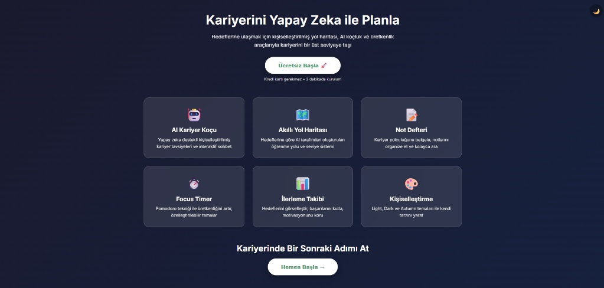

# 🚀 GuidyMate


**GuidyMate** is an AI-powered career planning assistant that provides personalized roadmaps, tracks goals, and supports development with productivity tools.

> *A Full-Stack web application that helps users manage their career journey through a gamified experience.*

---

## 📱 Preview

<div align="center">

### 🏠 Landing & Login
 

### 📊 Dashboard & Features
 

### ⏱️ Focus Timer


</div>

> 💡 **Video Demos:** AI Coach, Notes, and Timer demos are available in the [screenshots](./screenshots) folder.

---

## 🎯 Key Features

✅ **AI Career Coach** - 24/7 personalized career guidance  
✅ **Smart Roadmap** - Level-based progression system (1-10)  
✅ **Focus Timer** - Customizable Pomodoro with themes  
✅ **Multi-Theme** - Light, Dark, and Autumn modes  
✅ **Secure Auth** - Google OAuth 2.0 integration  
✅ **Multi-Language** - Turkish and English support  
✅ **Smart Notes** - Organize your learning journey

---

## 🛠 Tech Stack

**Frontend:**
- React 18 + Vite
- CSS Modules
- Context API
- Google OAuth 2.0

**Backend:**
- Node.js + Express.js
- PostgreSQL
- JWT Authentication
- Bcrypt

**AI:**
- Groq SDK (Llama-3 Model)

**Tools:**
- Git
- Docker
- Render/Vercel

---

## 🚀 Getting Started

```bash
# 1. Clone the repository
git clone https://github.com/EdaNurBinici/guidymate-app.git
cd guidymate-app

# 2. Backend Setup
cd web-app-api
npm install
# Create .env file with your database credentials
npm start

# 3. Frontend Setup (New Terminal)
cd frontend
npm install
npm run dev
```

For detailed setup instructions, see [SETUP.md](./SETUP.md)

---

## 🏗 Architecture

**MVC-inspired modular structure:**

- **Frontend:** Component-based architecture with dedicated modules for Roadmap, Notes, and AI Coach
- **Backend:** RESTful API with separated service layer, controllers, and routes
- **Database:** Relational design (Users, Profiles, Roadmaps tables)

---

## 📚 Documentation

- [Quick Start Guide](./QUICK-START.md)
- [Deployment Guide](./DEPLOYMENT.md)
- [Features Overview](./FEATURES.md)
- [Troubleshooting](./TROUBLESHOOTING.md)
- [Contributing Guidelines](./CONTRIBUTING.md)

---

## 📄 License

This project is licensed under the MIT License - see the [LICENSE](./LICENSE) file for details.

---

## 👤 Developer

**Eda Nur Binici**

[](https://www.linkedin.com/in/eda-nur-binici/)
[](https://github.com/EdaNurBinici)

---

⭐ If you like this project, please give it a star!
